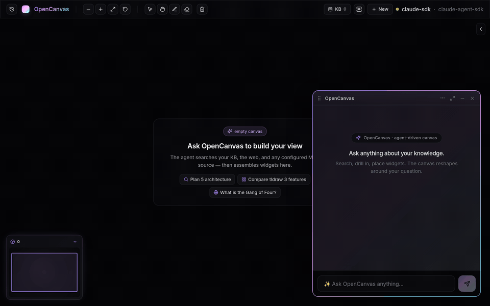

# OpenCanvas

> A local desktop knowledge surface — ask anything, an agent reshapes a canvas of cited widgets to answer.



OpenCanvas is a single-user, BYO-credentials desktop app. You ask a question; an agent searches your indexed knowledge (docs, code, prior conversations), the web, and any MCP server you wire up; then it **places typed widgets on an infinite tldraw canvas** — markdown, code blocks, tables, timelines, file trees, kanban boards, sticky notes, composite cards — and replies with a short note pointing to what it built. Every conversation indexes back into the same store, so the canvas gets smarter with use.

It runs entirely on your machine. The only outbound calls are to the LLM provider you choose, the embedder if you don't use the bundled one, Tavily for web search, and any MCP servers you configure.

---

## What's interesting

- **Self-improving KB** — every conversation auto-indexes into the same SQLite store as your docs/code; `search_kb` finds prior chats. The system gets smarter as you use it.
- **Multi-agent `/team`** — three agents pass a baton: Researcher gathers evidence, Builder synthesizes, Critic flags gaps. Each phase sees the canvas the prior phase built.
- **Native canvas, not chat-text** — answers materialize as 12 typed widget kinds. All draggable, resizable, collapsible, role-tinted.
- **MCP-native** — any MCP server in your config (filesystem, Confluence, Jira, …) is exposed to the agent automatically as `mcp__<source-id>__<tool>`.
- **Per-conversation canvas** — switch threads via the History panel; canvas + chat swap atomically.
- **Live progress in-input** — every chat turn shows the active step (📚 searching KB · 🌐 web · 🎨 placing widget · ✍️ writing) right where you're typing.
- **Mini-map + sources panel** — bottom-left thumbnail of the canvas, drawer listing every indexed source.

---

## Quick start

```bash
pnpm install
cp .env.example .env       # fill in keys you want (Anthropic / OpenAI / Tavily / Jira / …)
pnpm cli --probe           # health-check provider + embedder
pnpm electron:dev          # open the desktop app (backend + Vite + Electron, all in one)
```

Or run headless without Electron and open in a browser:

```bash
pnpm dev                   # backend on :3457, app on :3458 → http://127.0.0.1:3458
```

### Pick any LLM

OpenCanvas is **model-agnostic**. Six provider adapters ship out of the box; pick whichever matches your account or runs locally on your machine. Set the corresponding env var in `.env` and switch by editing `~/.opencanvas/config.json` (or pass `--profile <name>` on the CLI):

| Provider | Config `llm.provider` | Auth | Notes |
| --- | --- | --- | --- |
| Claude Agent SDK | `claude-agent-sdk` | OAuth via Claude Code, or `ANTHROPIC_API_KEY` | In-process MCP tool surface — fastest agent loop |
| Anthropic direct | `anthropic-direct` | `ANTHROPIC_API_KEY` | Plain API; specify any Claude model |
| OpenAI | `openai` | `OPENAI_API_KEY` | GPT-4o, GPT-4.1, etc. |
| OpenRouter | `openrouter` | `OPENROUTER_API_KEY` | One key, hundreds of models incl. Llama, Mistral, DeepSeek |
| Ollama | `ollama` | none — local | Any model you've pulled (`llama3`, `qwen2.5-coder`, `gpt-oss`, …) |
| Sourcegraph Amp | `amp` | `AMP_API_KEY` | Agent loop with their hosted models |

Config example with **Ollama running locally**:

```jsonc
{
  "activeProfile": "local",
  "profiles": [{
    "name": "local",
    "llm": { "provider": "ollama", "model": "llama3.1:8b", "baseUrl": "http://localhost:11434" },
    "embed": { "provider": "ollama", "model": "nomic-embed-text" },
    "sources": []
  }]
}
```

Embedders are also pluggable: bundled ONNX (`BAAI/bge-small-en-v1.5`, runs offline), OpenAI, Voyage, or Ollama. See `.env.example` for keys.

Health-check whatever you picked:

```bash
pnpm cli --probe                                  # active profile
pnpm cli --profile local --probe                  # named profile
```

### Web search

Set `TAVILY_API_KEY` in `.env` (free tier: 1000 searches/month at <https://app.tavily.com>). Without it, `web_search` returns an explicit "not configured" error rather than silently failing.

### MCP sources

Add servers under `profiles[].sources` in `~/.opencanvas/config.json` (works with any LLM provider — the agent calls them via tool-use whether it's Claude, GPT, Llama, or anything else):

```jsonc
{
  "activeProfile": "default",
  "profiles": [{
    "name": "default",
    "llm": { /* any of the providers above */ },
    "sources": [{
      "id": "dev-filesystem",
      "name": "Development directory",
      "transport": "stdio",
      "command": "npx",
      "args": ["-y", "@modelcontextprotocol/server-filesystem", "/Users/me/Development"]
    }]
  }]
}
```

Verify with `pnpm cli --probe-sources`. Then chat — the agent calls them as `mcp__dev-filesystem__<tool>`.

---

## Slash commands

Type `/` in chat to see the popover.

| Command | Effect |
| --- | --- |
| `/team <prompt>` | Run the Researcher → Builder → Critic pipeline |
| `/clear` | Start a new conversation (current one stays in History) |
| `/template <id>` | Switch active canvas template (`ask-anything`, `tell-me-about-x`, `whats-new-since-y`, `trace-x-everywhere`) |
| `/help` | List every command |

---

## Indexing your knowledge

Two CLI commands populate the SQLite KB directly (handy for one-off doc folders):

```bash
pnpm cli --index ./docs            # markdown / text → chunked + embedded
pnpm cli --index-code ./src        # .ts/.tsx/.js/.jsx → tree-sitter chunks + symbols
pnpm cli --search "<query>"        # hybrid BM25 + vector search across everything
pnpm cli --storage-status          # path + size + table row counts
```

For richer multi-source projects (code + Jira + Confluence + Stash):

```bash
pnpm cli --kb-init my-svc --kb-root /path/to/repo
# then edit ~/.opencanvas/config.json knowledgeBase.projects[] to add jira/confluence/stash
pnpm cli --kb-ingest my-svc        # auto-enriches each chunk with 12 hypothetical user queries
pnpm cli --kb-status my-svc        # cursor + counts per source + per link type
```

Re-indexing is **idempotent** — re-running on unchanged content does zero LLM calls (the QA enricher caches per-chunk via sha256 hash).

Conversations index back into the same store automatically after every assistant turn — no command needed.

---

## Architecture

```
┌────────────────────────┐                ┌─────────────────────────┐
│  Vite + React + tldraw │   /v1/chat     │  Hono backend           │
│  app on :3458          │ ─────────────→ │  (provider abstraction) │
│                        │   /v1/team     │                         │
│  • Floating chat       │ ─────────────→ │  LLMProvider adapter    │
│  • tldraw canvas       │                │  (Claude / GPT /        │
│  • Conversations       │                │   Llama / Ollama / …)   │
│  • Sources panel       │                │       │                 │
│  • Mini-map            │ ←─── UIMS ──── │       ▼                 │
│                        │                │       │                 │
└────────────────────────┘                │       ▼                 │
                                          │  11 in-process tools    │
                                          │  + external MCP servers │
                                          │       │                 │
                                          │       ▼                 │
                                          │  SQLite + sqlite-vec    │
                                          │  (chunks + embeddings)  │
                                          └─────────────────────────┘
```

**Backend** (`src/`): Hono routes (`/v1/chat`, `/v1/team`, `/v1/search`, `/v1/index-conversation`, `/v1/sources/list`, `/v1/health`, …). The `LLMProvider` interface is a thin streaming contract; six adapters implement it (Claude SDK, Anthropic direct, OpenAI, OpenRouter, Ollama, Sourcegraph Amp), and adding a seventh is one file. `SearchService` is hybrid BM25 + sqlite-vec with reciprocal rank fusion (k=60). KB pipeline owns chunking + QA enrichment + per-project source state.

**Frontend** (`app/`): tldraw 3 with custom shape utils for each widget kind. Zustand stores for conversations, templates, canvas stats, UI flags. AI SDK 6 `useChat` for chat streaming over the UI Message Stream protocol; live tool events drive the canvas dispatcher.

**12 widget kinds**: `markdown`, `code-block`, `ticket`, `web-embed`, `key-value-card`, `table`, `timeline`, `file-tree`, `composite`, `tasks`, `kanban`, `sticky-note`.

**11 agent tools** (in-process MCP): `search_kb`, `fetch_result`, `web_search`, `place_widget`, `update_widget`, `read_canvas`, `read_widget`, `focus_widget`, `link_widgets`, `clear_canvas`, `switch_template`. External MCP servers add their own (`mcp__<source-id>__<tool>`).

---

## Drive the canvas from any app — `/v1/canvas/*` REST surface

Any process on the local machine can render widgets on a running OpenCanvas instance via HTTP. The browser keeps a long-lived SSE open to `/v1/canvas/events`; external `POST`s push directives into the per-conversation event bus, which fans out to every connected tab.

**Auth.** Optional. If `OPENCANVAS_API_KEY` is set in the backend's environment, every `/v1/canvas/*` request must include `Authorization: Bearer <key>`. Unset → no auth (dev default).

**Conversation routing.** Each request takes an optional `conversationId` (in body or query). When omitted, the backend uses whichever conversation the browser most-recently said it was on (mirrored on every conversation switch). 404 if neither is set.

### Endpoints

```
POST   /v1/canvas/widgets                  { kind, role, payload, conversationId? } → { id, directive }
PATCH  /v1/canvas/widgets/:id              { payload? | appendSections? }
POST   /v1/canvas/widgets/:id/focus
DELETE /v1/canvas/widgets/:id
POST   /v1/canvas/clear
POST   /v1/canvas/links                    { fromId, toId, label? } → { linkId }
POST   /v1/canvas/template                 { id }
GET    /v1/canvas/snapshot                 → { activeTemplateId, widgets[] }

POST   /v1/canvas/streams                  { kind, role, scaffold } → { id }
POST   /v1/canvas/streams/:id/ops          { ops: WidgetStreamOp[] }     # seq auto-assigned
POST   /v1/canvas/streams/:id/end          { ok, error? }
POST   /v1/canvas/streams/:id/cancel

POST   /v1/canvas/active-conversation      { conversationId }            # browser → backend hint
GET    /v1/canvas/events?conversationId    # SSE — browser → backend
```

`kind` accepts any registered widget kind (`markdown`, `code-block`, `ticket`, `web-embed`, `key-value-card`, `table`, `timeline`, `file-tree`, `composite`, `tasks`, `kanban`, `sticky-note`, `time`, `generic`). Unknown kinds and malformed payloads auto-classify into a `generic` widget — the response includes `reformatted: { from, reason }` so the caller can see what was rewritten.

### Place a widget from any process

```bash
curl -s -X POST http://localhost:3457/v1/canvas/widgets \
  -H 'content-type: application/json' \
  -d '{
    "kind": "markdown",
    "role": "primary",
    "payload": { "title": "From outside", "body": "**Hello** from curl." }
  }'
```

### Stream a long markdown answer from a Python script

```python
import requests, time

BASE = "http://localhost:3457/v1/canvas"

# 1) open a stream — returns the widget id
r = requests.post(f"{BASE}/streams", json={
    "kind": "generic", "role": "primary",
    "scaffold": {
        "title": "Streaming from Python",
        "blocks": [{"type": "markdown", "content": ""}],
    },
}).json()
wid = r["id"]

# 2) push paragraphs as they're produced
for paragraph in long_answer_generator():
    requests.post(f"{BASE}/streams/{wid}/ops", json={
        "ops": [{"kind": "append-text", "blockIndex": 0, "text": paragraph + "\n\n"}],
    })
    time.sleep(0.05)

# 3) close cleanly
requests.post(f"{BASE}/streams/{wid}/end", json={"ok": True})
```

### Listen for events from another browser/script (SSE)

```javascript
const es = new EventSource(
  '/v1/canvas/events?conversationId=' + encodeURIComponent(activeId),
);
es.addEventListener('directive', (ev) => {
  const directive = JSON.parse(ev.data);
  console.log('canvas event', directive);
});
```

The directive shape is the same `ToolDirective` union the in-process agent uses (`place`, `update`, `focus`, `clear`, `remove`, `link`, `switchTemplate`, `stream-{start,op,end}`). Subscribers can build dashboards, recorders, or alternate frontends from the same firehose.

---

## Development

```bash
pnpm test                                          # backend (vitest, Node)
pnpm exec vitest run --config app/vite.config.ts   # frontend (vitest + jsdom)
pnpm typecheck                                     # tsc --noEmit (root)
pnpm exec tsc --noEmit -p app/tsconfig.json        # tsc (app)

pnpm dev                                           # backend + Vite (no Electron)
pnpm electron:dev                                  # backend + Vite + Electron desktop window
pnpm dist:linux                                    # build installer (mac / win / linux)
```

The dev backend uses `tsx` (no watcher). To pick up backend changes you need to restart `pnpm dev`. Vite HMRs the frontend.

### Project layout

```
src/                                # backend (Node, ESM)
  agent/                            # tools/, payloads.ts, types.ts, canvas-snapshot.ts
  backend/                          # Hono app + routes/
  config/                           # ~/.opencanvas/config.json loader + zod schema
  connectors/                       # code, jira, stash, confluence
  embedders/                        # bundled-onnx, openai, voyage, ollama
  indexer/                          # orchestrator, chunker, qa-enricher, link-extractor
  kb/                               # cli-commands, export
  mcp/                              # transport, source registry
  providers/                        # claude-agent-sdk, anthropic-direct, openai, …
  search/                           # FTS5 + sqlite-vec hybrid + RRF
  storage/                          # SQLite open + migrations
  walk/                             # source-files
  web/                              # tavily

app/                                # frontend (Vite + React 19 + tldraw 3)
  src/
    canvas/                         # Tldraw setup + 13 shape utils + dispatcher
    components/                     # Chat, FloatingChat, KbHits, ComposerStatus, …
    state/                          # zustand stores
    styles/globals.css              # design tokens + chrome

electron/main.cjs                   # Electron wrapper
docs/                               # historical specs / demo gif
```

---

## Status

Experimental. Single-user, BYO credentials, runs entirely on your machine. The only outbound network calls are to your chosen LLM provider, the embedder if you use OpenAI / Voyage, Tavily for web search, and any MCP servers you configure.
